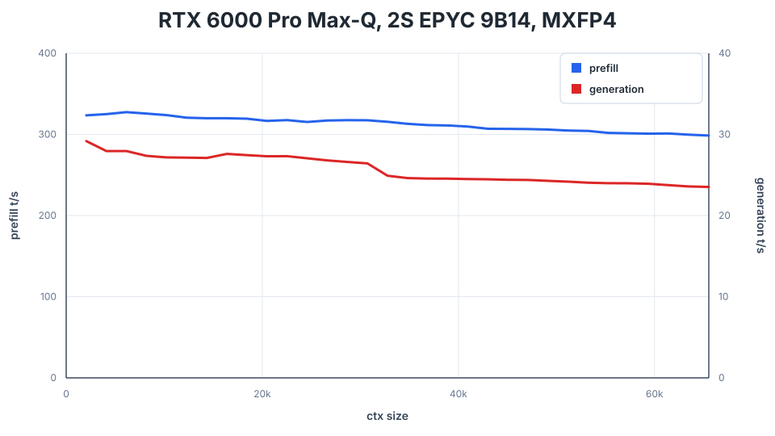

# DwarfStar x ktransformers

## Fork: kt-kernel integration for MoE on CPU/NUMA w/QAT MXFP4 weights

MoE FFN is sparse and for single/low user systems DDR memory can be much
more economically viable than VRAM.

However, concurrency is needed to extract the full potential of multi-
channel (DDR) / multi-socket (NUMA) systems.

ktransformers' [kt-kernel](https://github.com/kvcache-ai/ktransformers/tree/main/kt-kernel)
solves this problem by providing NUMA-aware (tensor parallel) MoE/FFN kernels for x64 CPUs. (AMX/AVX512)

This fork integrates kt-kernel into the [DwarfStar](https://github.com/antirez/ds4) engine
allowing Intel/AMD systems to run hybrid inference w/routed experts on CPU/DDR memory.

Behold:
- Original vendor's QAT [safetensors](https://huggingface.co/deepseek-ai/DeepSeek-V4-Flash) MXFP4 MoE weights, no PTQ
- Efficient TP MoE kernels with explcit NUMA support
- Minimize VRAM usage to embed/attn/shexp tensors, allowing
- 500K context w/30GB VRAM, or
- 1M context w/50GB VRAM.
- Up to 320tps prefill (100Kctx), 30tps decode (1K ctx)

The integration is transparent: pass `--cpu-moe --kt-weight-path <dir>` and
the engine routes every routed-MoE matmul through kt-kernel instead of the
GPU, while attention, shared experts, and HC mixing remain on the GPU.



## Quick start

```bash
## Prerequisites
sudo apt install libnuma-dev


## Create a workarea
mkdir ds4_numa
cd ds4_numa


## Acquire and Build: kt-kernel / kt-bridge
git clone -b kt-bridge --single-branch --recursive https://github.com/usrlocalben/ktransformers
mkdir ktransformers/kt-kernel/build
pushd ktransformers/kt-kernel/build
cmake .. -DCMAKE_BUILD_TYPE=Release -DKTRANSFORMERS_CPU_USE_AMX_AVX512=ON
cmake --build . --target kt_bridge -j$(nproc)
popd
# Observe: libkt_bridge.so created in ktransformers/kt-kernel/build/


# Optional: e.g. sudo install ktransformers/kt-kernel/build/libkt_bridge.so /usr/local/lib/


## Acquire and Build: ds4 w/kt-kernel support0
git clone -b numa-moe https://github.com/usrlocalben/ds4
cd ds4
make \
  KT_BRIDGE_INC=../ktransformers/kt-kernel/bridge \
  KT_BRIDGE_LIB=../ktransformers/kt-kernel/build/libkt_bridge.so \
  cuda-generic


## Acquire antirez GGUF for embed/attn/output etc.
# As of 2026-05-28 the 2-bit and 4-bit GGUFs are the same wrt. embed/attn/output etc.
# from huggingface.co/antirez/deepseek-v4-gguf
# DeepSeek-V4-Flash-IQ2XXS-w2Q2K-AProjQ8-SExpQ8-OutQ8-chat-v2-imatrix.gguf
# (or use the ds4 provided downloader)


## Acquire OEM satetensors for _exp (~150GB)
# huggingface.co/deepseek-ai/DeepSeek-V4-Flash
# uvx --with 'huggingface_hub[cli]' hf download 'deepseek-ai/DeepSeek-V4-Flash' --local-dir /path/to/ds4f/safetensors/


# use LD_LIBRARY_PATH or e.g. copy the lib to /usr/local/lib etc.
export LD_LIBRARY_PATH=/path/to/ds4_numa/ktransformers/kt-kernel/build:$LD_LIBRARY_PATH

# important: ds4 assumes there isn't enough VRAM for 1M context
#            and will switch to managed CUDA memory. avoid this!
export DS4_NO_MANAGED_KV=1

## Run the server
# Example: 2S 9B14(96c x2) NPS4 = 8 NUMA nodes
# 128 / 8 threads per node
# tip: probe/sweep thread count to find optimal perf.
# Important: Use DS4_NO_MANAGED_KV=1 to avoid long-context managed mem policy
./ds4-server \
  --host 0.0.0.0 \
  --port 8888 \
  -m /path/to/antirez/gguf/DeepSeek-V4-Flash-Q4KExperts-F16HC-F16Compressor-F16Indexer-Q8Attn-Q8Shared-Q8Out-chat-v2-imatrix.gguf \
  -c 1000000 \
  --cuda --cpu-moe \
  --kt-weight-path /path/to/safetensors/deepseek-ai/DeepSeek-V4-Flash \
  --kt-cpuinfer 128 \
  --kt-threadpool-count 8

## observe: ~300t/s prefill @ 0-100K context length
##            30t/s decode  @ 1K context length
##        nvidia-smi: 49,794MiB VRAM usage w/1M ctx
```

Legacy GGUF files are still available if you specifically need the older
non-imatrix quants:

```sh
./download_model.sh q2           # 96/128 GB RAM machines, legacy non-imatrix
./download_model.sh q4           # >= 256 GB RAM machines, legacy non-imatrix
./download_model.sh pro          # 512 GB RAM machines, legacy non-imatrix PRO
```
